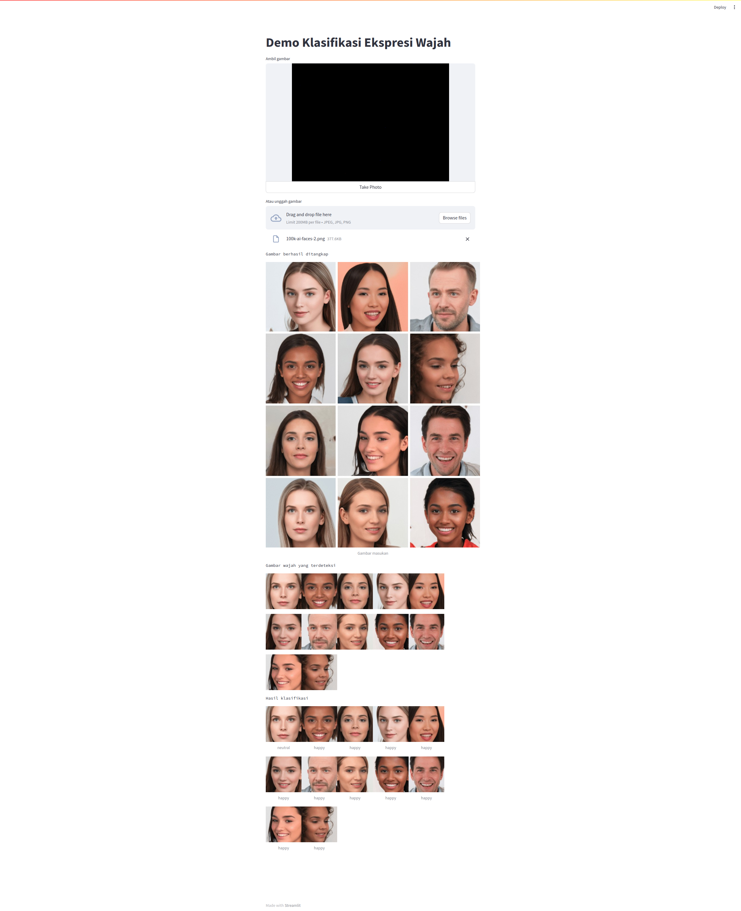

# facial-expressions: implementation

## Required system:
- NVIDIA GPU(s) with `compute_75` arch (GTX/RTX Turing – GTX 1660 Ti, RTX 2060, RTX 2070, RTX 2080, Titan RTX, Quadro RTX 4000, Quadro RTX 5000, Quadro RTX 6000, Quadro RTX 8000, Quadro T1000/T2000, Tesla T4)

## How to run the demo:
1. Install docker and supporting dependencies.
2. Install NVIDIA proprietary driver on your system. 
If you have install it correctly, you can validate using `nvidia-smi` command.
3. Setup Docker build system to use NVIDIA runtime, [read more](https://docs.nvidia.com/datacenter/cloud-native/container-toolkit/latest/install-guide.html).
4. Build this folder using: 
`docker build . -t [preferred_image_name]`
5. Run the built image using: 
`docker run -it --gpus '[YOU SHOULD SPECIFY YOUR GPU DEVICE HERE]' -p 8501:8501 [preferred_image_name` 
You can use multiple gpus, but make sure it has same architecture like mentioned before, example: 
`docker run -it --gpus '"device=0"' -p 8501:8501 facial-expressions-essay:latest`
6. Open `localhost:8501` to access Streamlit web page
7. The web will look like the following.

8. You can choose to upload a local picture or take a picture using the device camera.

## Troubleshooting:
1. nvidia-smi: command not found during building the image
You should disable Docker buildkit, [read more](https://github.com/NVIDIA/nvidia-container-toolkit/issues/122). 
Or delete docker-buildx plugin (`sudo apt remove docker-buildx-plugin`), not recommended if you use a shared stateful system.
